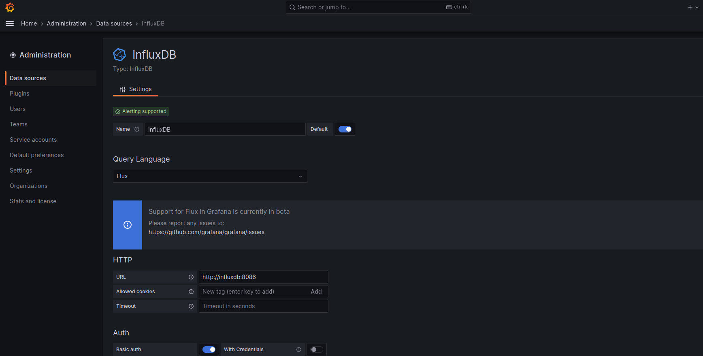
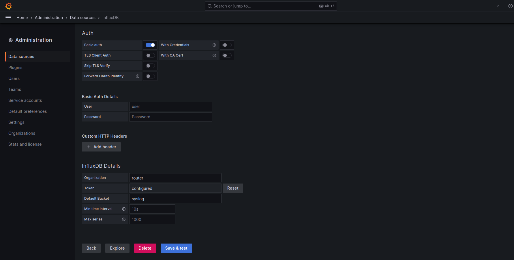

# Grafana-Influxdb2.x-Syslog-server
A Guide to install syslog serve with Influxdb 2.x, telegraf and syslog-ng

Set up a lightweight syslog server for your home devices and also scalable for enterprise using Grafana, influxdb and telegraf.

# How does it works?

First, you send the UDP logs to the syslog-ng container that will push the log to telegraf for pursing and structuring the data for pushing into the influxdb and than you will use Grafana to visualize and query the logs.

Now you may ask why using syslog-ng container?

- Telegraf supports only certain format of **UDP** syslog. According to their official [documentation](https://github.com/influxdata/telegraf/blob/master/plugins/inputs/syslog/README.md): 

> By default RFC5424 is used. RFC3164 only supports UDP transport (no streaming support) 

## To solve this issue:

 we feed the logs to syslog-ng and then syslog-ng formats the log that is accepted by the telegraf. (If you are sending logs from rsyslog or syslog-ng you can skip the syslog-ng container and directly send that data to telegraf. For that you have to edit docker-compose.yml file and expose the **TCP** port for telegraf.)

# This is how it works:


# How to install:
Install [docker](https://docs.docker.com/engine/install/) and [docker-compose](https://docs.docker.com/compose/install/) according to your OS.

1. Clone the repo in your desired directory by
```
git clone https://github.com/AAm-kun/Grafana-Influxdb_2.x-Syslog-server.git
```
2. Go to the cloned folder and change the parameters according to your need in docker-compose.yml file
3. Open terminal in that directory and run 

For docker compose v1:
```
sudo docker compose up -d
```
For docker compose v2: 
```
sudo docker-compose up -d
```

- If all containers starts correctly go to the grafana webui using browser http://localhost:3000
- Default credential is admin/admin (change it).
- Go to Administration -> Data sources -> Add new data source and fill the required field according to your **docker-compose.yml** file.
Be sure that you select the **Query Language** as **flux** and also you have to put the token from the **docker-compose.yml** file.
Your final page should look something like this (might vary accroding to your credentials)


- click on save and test.
- If you did everything correctly you will get a notification stating that your data source is working.
- Now import the dashboard in Grafana.
- Go to Dashboards -> New -> import.
- Put id **18679** and click load.
- Select the data source as your configured Influxdb and click **import**.
- And finally you will see your logs in the dashboard.

Lastly you have to configure your server or router to send syslog to your syslog server ip and port. 


